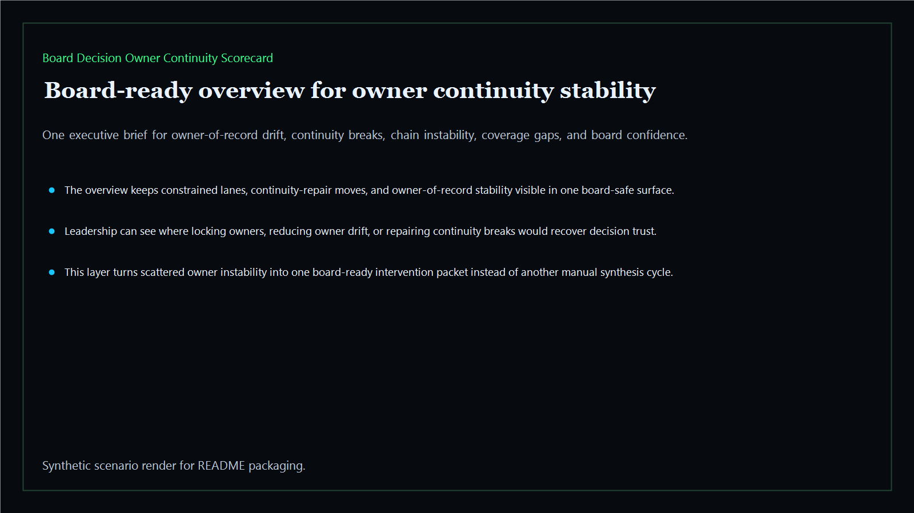
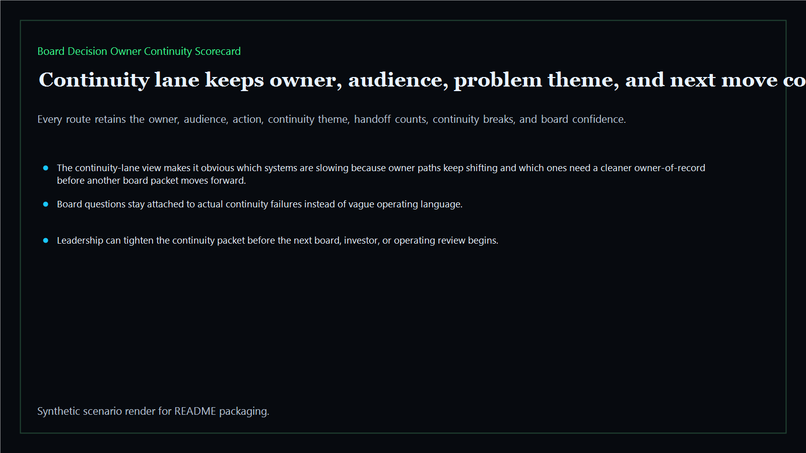
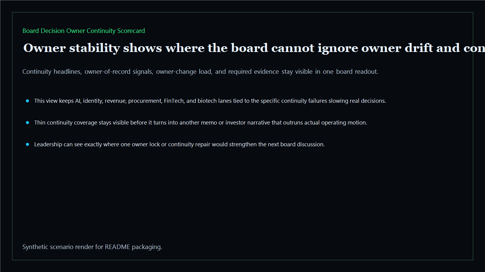
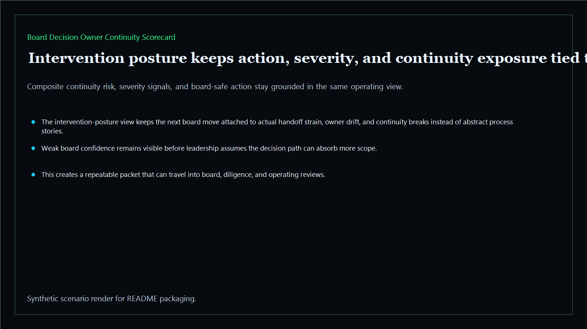

# Board Decision Owner Continuity Scorecard

Board-ready owner-continuity scorecard for tracking whether final decision ownership remains stable, legible, and board-safe across the executive estate.

- Live: `https://continuity.kineticgain.com/`
- Repo: `mizcausevic-dev/board-decision-owner-continuity-scorecard`

## Why this matters

Leaders need more than one-time owner resets. They need one scorecard that shows where decision ownership remains stable, where continuity is slipping, and which lanes are too fragile for another board cycle.

## What it includes

- TypeScript executive-intelligence surface for owner-continuity scoring with modeled owner-of-record lanes, continuity drift, stability thresholds, and board-safe intervention posture
- synthetic executive lanes across AI, identity, revenue, FinTech, biotech, procurement, and public-sector readiness
- reusable outputs for continuity lanes, ownership scorecards, intervention packets, and board-ready operating memos
- prerendered static site, JSON payloads, screenshots, and docs

## Product depth

This is the continuity layer for executive accountability. It is designed for leaders who need to know whether a decision can survive handoffs, reorganizations, vendor changes, and board scrutiny without losing the final accountable owner.

- **Buyer value:** shows CEOs, operators, and investors where ownership has become too fragile to support another strategic cycle.
- **Technical proof:** converts owner-of-record lanes, continuity breaks, change frequency, evidence coverage, and board confidence into reproducible JSON and static routes.
- **GTM story:** positions Kinetic Gain as the operating system that turns vague "who owns this?" risk into a board-ready continuity scorecard.

## What these repos have in common

Kinetic Gain executive-intelligence repos use the same proof pattern: structured sample data, deterministic scoring, board-readable pages, CLI output, API routes, prerendered static assets, screenshots, and verification notes. The goal is not another dashboard mockup. The goal is a repeatable packet that a non-technical executive can read and a technical reviewer can inspect.

## Operating workflow

1. Normalize each decision lane into owner, audience, continuity theme, risk signals, and next move.
2. Score continuity health from handoffs, owner changes, coverage gaps, clarity, and board-confidence strain.
3. Produce a board-facing narrative that explains what must be locked, delegated, escalated, or repaired next.

## Routes

- `/`
- `/continuity-lane`
- `/owner-stability`
- `/intervention-posture`
- `/verification`
- `/docs`

## Local run

```bash
cd board-decision-owner-continuity-scorecard
npm install
npm run verify
npm run prerender
npm run render:assets
```

## CLI

```bash
npx board-decision-owner-continuity-scorecard fixtures/board-decision-owner-continuity-scorecard.json --format summary
npx board-decision-owner-continuity-scorecard fixtures/board-decision-owner-continuity-scorecard-clean.json --format json
```

## Docs

- [Architecture](docs/architecture.md)
- [Origin](docs/ORIGIN.md)
- [Kinetic Gain Embedded](docs/KINETIC_GAIN_EMBEDDED.md)

## Screenshots





